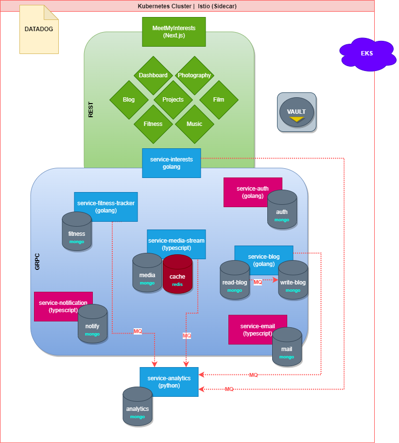

# Welcome to MeetMyInterests!

## This application serves as a portal into my professional background and interests.



## Services
- Responsive, Interactive UI to Showcase Professional Experience (ui-meetmyinterests)
    - React/ Next.js (SSR)
    - HTML5 Canvas
    - Media Queries
    - Grid/Flexbox
    - Antd Design
    - Webp Image Formats
- Services Broken into a Domain Driven Microservices Architecture 
    - **golang**
        - service-interests 
        - service-blog 
        - service-fitness-tracker
        - service-auth
    - **python**
        - service-analytics
    - **node/typescript**
        - service-notifcation
        - service-email
        - service-media-stream

Service-Blog has a CQRS (Command-Query Responsbility Segregation) Architecture to Seperate Read & Writes operations for better scalability. An event bus via RabbitMQ is used for sync across the write to read database.

## Technologies
- Containerization via Docker & Managed by Kubernetes & Helm Charts
- Isitio leveraged as API Gateway for Load Balancing
- Isitio used as Service Mesh for service discovery
- Deployed on Amazon EKS via Terraform
- Pipeline Orchestrator via Harness w/ Sonarcube Integration
- Utilizing Redis for Cacheing of Media for Streaming
- Sensitive Configuration stored/ retrieved in Hasicorp Vault
- MongoDB Cluster Sharding w/ 3 nodes
- Logging using Datadog
- 100% Code Coverage
- Linters used: 
- Passwords are hashed using a Argon2id hash function using Blake2.
- Canary integrations for gradual rollouts

## Local Setup

### Languages
```
choco install golang
choco install nodejs
choco install python
choco install protoc

```

* Notice about PBs
1. PBs and .proto files are used to define messaging and the functions utilized in a GRPC service. 

2. The PB file is generated by running the below command in the communicating service's language. It can then be imported, registered to a GRPC server, and then invoked from the client.

```
protoc \
--go_out=. --go_opt=paths=source_relative \
--go-grpc_out=. --go-grpc_opt=paths=source_relative \
blog.proto

protoc \
--go_out=. --go_opt=paths=source_relative \
--go-grpc_out=. --go-grpc_opt=paths=source_relative \
auth.proto
```

### Infrastructure
```
choco install aws-cli
choco install docker
choco install terraform
choco install kubernetes-cli
choco install kubernetes-helm
choco install minikube
```

## Running Containers Locally
```
docker run -p 9100:9100 service-interests
docker run -p 8001:8001 service-blog
docker run -p 8002:8002 service-auth
docker run -p 3000:3000 meetmyinterests
```

## Running Locally with Minikube & Helm
```
helm repo add mongodb https://mongodb.github.io/helm-charts
helm install community-operator mongodb/community-operator

docker login
minikube start
. deploy/deploy.sh - Start all services
. deploy/takedown.sh - Takedown all services
```

# Encoding & Decoding Secrets
echo "devopscube" | base64 
//after encoding it, this becomes ZGV2b3BzY3ViZQo=

echo "ZGV2b3BzY3ViZQo=" | base64 --decode
//after decoding it, this will give devopscube

### Swagger

### Linter
Linting is utilized to maintain a safe, readable, and consistent coding standard throughout the services.

- golangci-lint is used as the primary linter for the go services as it has many different types of linters avaiable.
- eslinter is used as the linter for the node/next.js project

```
make testcoverage && make lint
```
## Coming Soon!
- Full Blog with Technical Tutorial Posts & Journey | Gifs, Images, Charts
- Fitness Tracker (For Weightlifting, Full Body | Upper-Lower | PPL)
- Photography Gallery
- Singing Videos
- Guitar Tracker